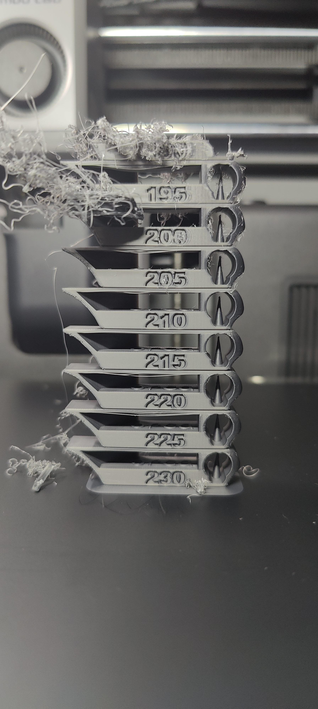
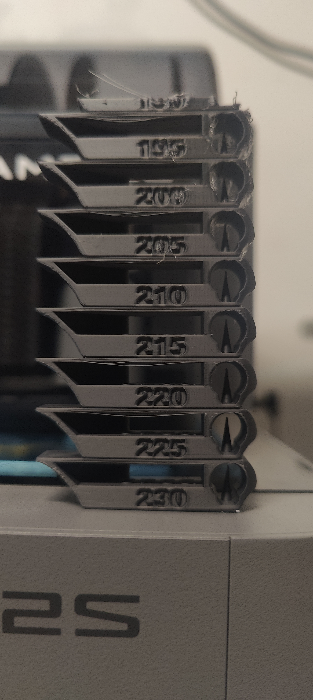

# Print Feedback

## Print Outcome
- **Success**: [ ] Yes / [ ] No / [x] Partial
- **Better than previous?**: [ ] Yes / [ ] No / [x] N/A (Initial test for new filament)

## Observations
- **Visual Quality**: 7/10
- **Dimensional Accuracy**: N/A
- **Strength/Durability**: N/A
- **Issues Encountered**: 
  - 190°C failed completely causing a massive mess.
  - Details on the printed numbers at 195°C, 200°C, and 205°C are not perfect.
  - The ceiling (bridges) dropped a little across most values, most visibly at 195°C, 205°C, 220°C, and 225°C.
  - 225°C and 230°C exhibited slight stringing around the right-side spike compared to the other temperatures.
  - **Best Overall Result**: **215°C** (bridging/ceiling drop was minimal).
  - **Runner-up Results**: 230°C (second best, but had slight stringing) and 210°C (third best).

## Photos

## Notes
- Added a new filament: Sunlu PLA+ 2.0 High Speed Grey.
- The new filament profile used most of the values from ObscuraNox settings as a baseline. Further calibrations are needed based on these starting values to adapt to our setup.
- The temp tower was printed from 230°C (bottom) to 190°C (top).
- **Recommendation for next iteration**: Set the printing nozzle temperature to **215°C**. Based on closer inspection, this temperature yields the best results because the ceiling bridging doesn't drop off as severely as the other temperatures, and it avoids the minor stringing seen at 225°C-230°C as well as the loss of detail on the numbers around 195°C-205°C. With 215°C dialed in, we can proceed to Flow Rate and Pressure Advance (PA) calibrations.
