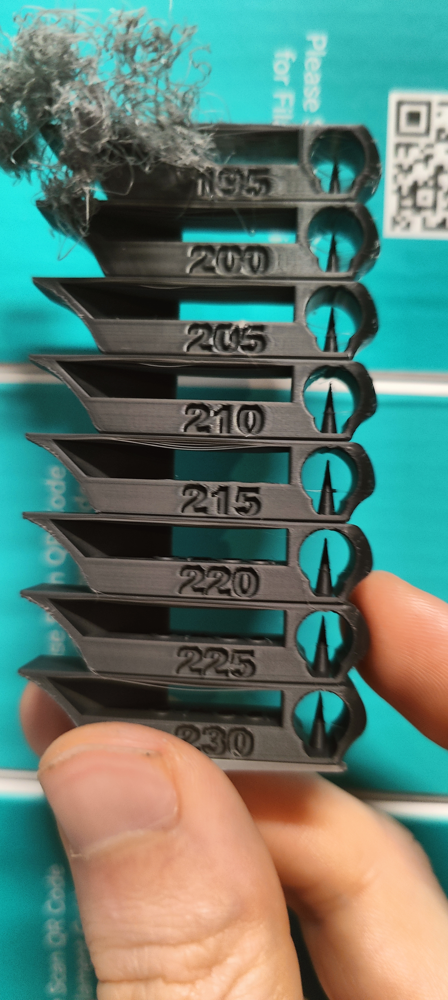

# Print Feedback

## Print Outcome
- **Success**: [x] Yes / [ ] No / [ ] Partial
- **Better than previous?**: [x] Yes / [ ] No / [ ] N/A

## Context
- **Print type**: Temperature tower calibration
- **Plate**: Smooth PEI Plate
- **Bed temperature**: 55°C
- **Tower range**: 195°C to 230°C (5°C steps)
- **Modifications active**: All v0.0.4 changes + 4cm top glass riser installed

## Observations
- **Visual Quality**: 7/10 (best segments are very clean; lower temps degrade significantly)
- **Dimensional Accuracy**: Good at optimal temp range
- **Strength/Durability**: N/A (calibration print)
- **Issues Encountered**:
  - **195°C**: Severe stringing, oozing, bridge failures — unusable
  - **200°C**: Strong bridge issues, heavy stringing
  - **205°C**: Bridge issues starting, stringing worsening, number detail beginning to degrade
  - **210°C**: Minor bridge issues and some stringing, details still acceptable
  - **215°C**: Clean bridges, no visible stringing, sharp details — good
  - **220°C**: Best result — no visible bridge issues, no stringing, crisp number details
  - **225°C**: Minor/small bridge issues, faint stringing (hard to see in photo), sharp details — very good
  - **230°C**: Not yet fully evaluated but appears comparable to 225°C range

## Ranking (best to worst temperature)
1. 🥇 **220°C** — No bridge issues, no stringing, best detail
2. 🥈 **225°C** — Very minor bridge issues, barely visible stringing
3. 🥉 **210°C** — Acceptable, slight stringing begins

## Photos

## Notes
- The print completed successfully with no clogs or interruptions — confirms v0.0.4 heat creep mitigations are working (bed at 55°C, 4cm glass riser, 100% min fan speed from layer 1, reverted retraction).
- **Recommended nozzle temperature going forward: 220°C**
- The 205°C threshold is where detail quality starts noticeably degrading: avoid going below 210°C for this filament on this printer/nozzle combo.
- Below 205°C stringing becomes progressively worse and bridges fail — the filament is clearly not designed to print this cold.
- Above 225°C, small imperfections reappear, suggesting the ideal window is narrow: **215°C–225°C**, with 220°C as the sweet spot.
