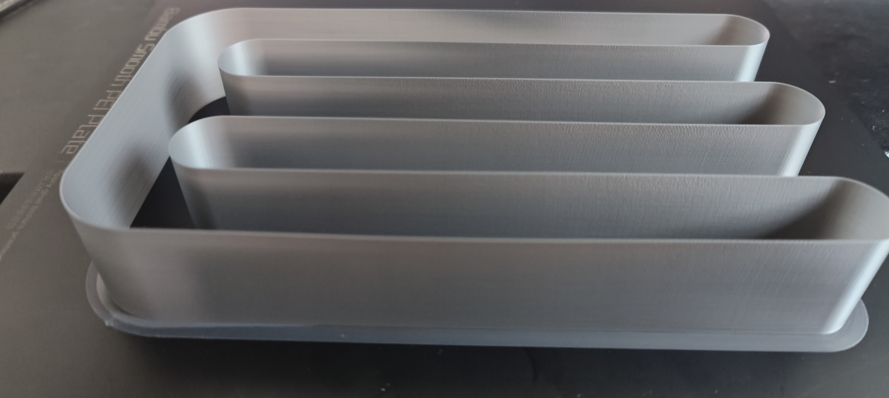
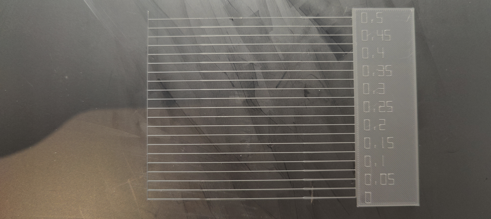
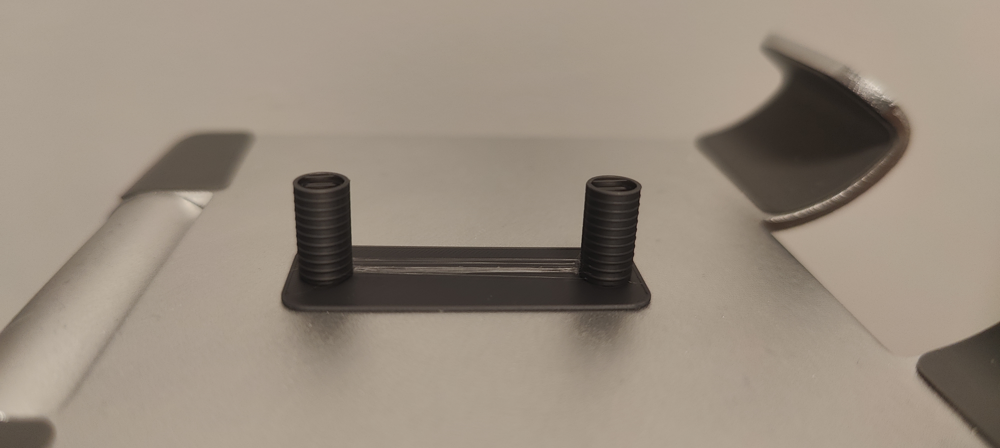

# Print Feedback

## Print Outcome
- **Success**: [x] Yes / [ ] No / [ ] Partial
- **Better than previous?**: [x] Yes / [ ] No / [ ] N/A

## Calibration Tests

### Max Volumetric Speed Test
- **Range tested**: 1 to 4 mm³/s, step 0.10
- **Result**: Looked perfect at every height
- **Chosen value**: 2 mm³/s (kept at default — no need to push higher)

### Pressure Advance Test
- **Result**: Optimal result appeared between 0.2 and 0.25
- **Chosen value**: 0.225

### Flow Rate Test
- **Range tested**: 0.95 to 1.05 (dozens of tests)
- **Result**: With PA set, all values looked excellent and very similar to the naked eye. Almost no underextrusion visible on any value.
- **Chosen value**: 1.0 (left at default)

### Retraction Test
- **Result**: Stringing stopped at the 2nd line (value: 0.2mm). A safe margin was added.
- **Chosen value**: 0.4mm retraction length
- **Additional overrides added**:
  - Retraction Length: 0.4mm
  - Retraction Speed: 30mm/s
  - Wipe while retraction: Yes

## Observations
- **Visual Quality**: 9/10
- **Dimensional Accuracy**: Good — no notable deviations observed
- **Strength/Durability**: N/A (calibration prints only)
- **Issues Encountered**: None — calibration results are very clean

## Photos

## Notes
- Flow Rate test has no photos but results were excellent across all tested values
- Retraction stringing actually stops at 0.2mm but 0.4mm is used as a safe margin
- This version finalizes the core calibration for this filament/nozzle combo
