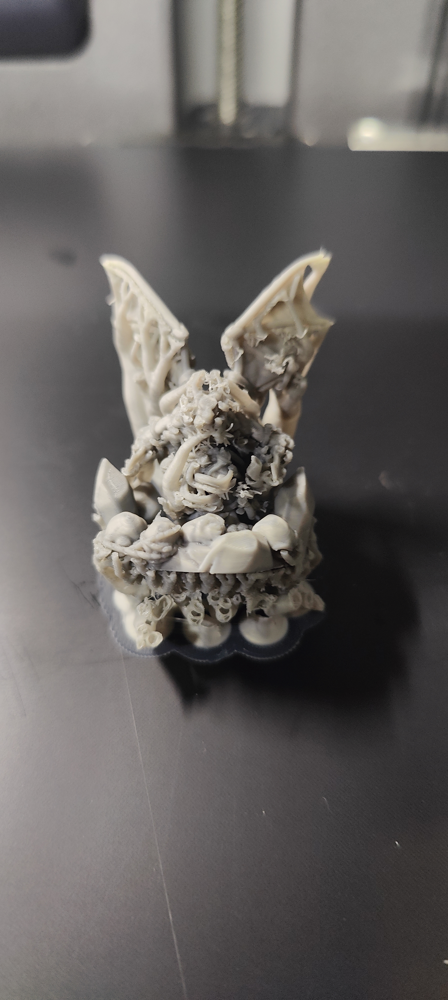
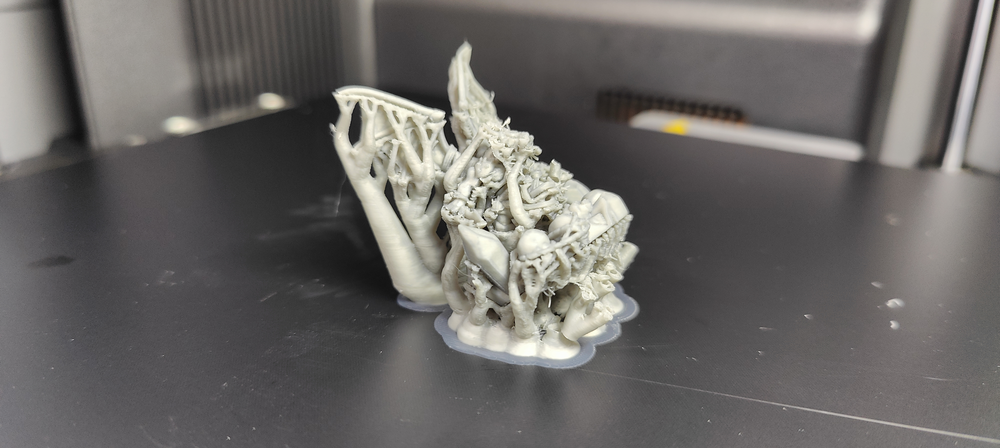
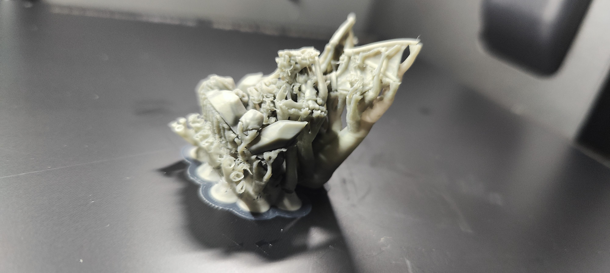
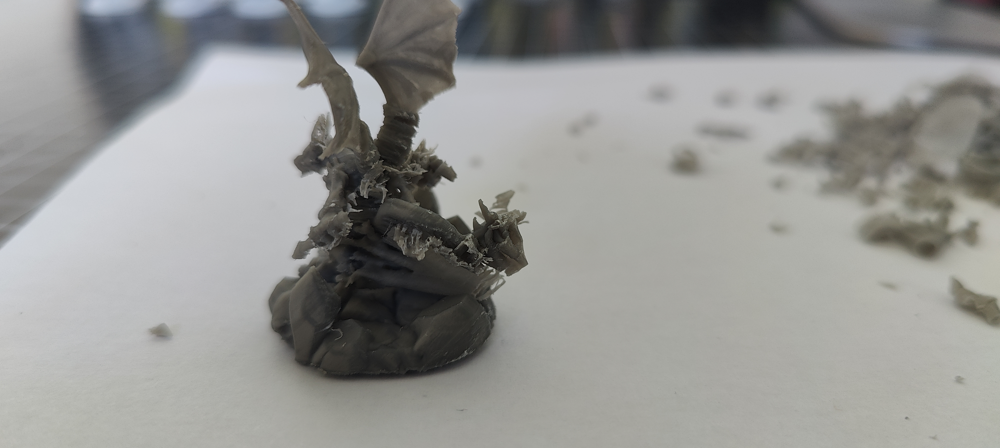
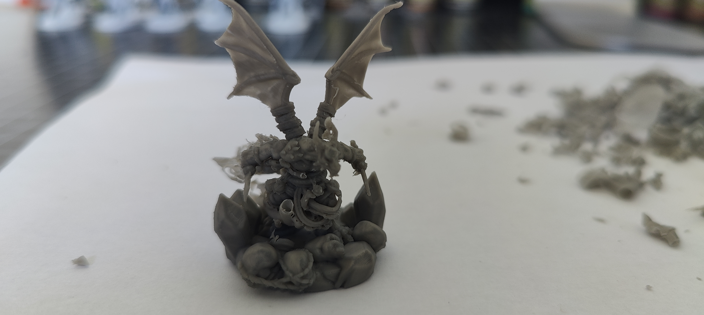

# Print Feedback

## Print Outcome
- **Success**: [ ] Yes / [ ] No / [x] Partial
- **Better than previous?**: [x] Yes / [ ] No / [ ] N/A

## Observations
- **Visual Quality**: 9/10 (Amazing details across the whole miniature)
- **Dimensional Accuracy**: N/A
- **Strength/Durability**: Good (The miniature did not fail even when some supports broke)
- **Issues Encountered**:
  - **Stringing**: Minor stringing in the first 2 or 3mm between support trees.
  - **Support Failure**: Some support trees broke during the print.
  - **Support Adhesion/Melting**: Some supports melted together with the miniature (notably on the tail, weapons, and legs) making them impossible to remove cleanly.
  - **Support Accessibility**: Some supports were almost inaccessible to remove, such as those between the legs and behind the belt.
  - **Easy Removal (Positive)**: Most of the support was easily removed on the wings, head, and some other parts.

## Photos

## Notes
- **Conclusion**: The details on the miniature are fantastic, but the support interface needs work. 
- **Goal for next version**: We need to ensure the removal of support has no issue at all, that it does not melt with the miniature and is always easy to snap and remove. 
- **Potential adjustments**:
  - Increase the Top Z distance / Support interface distance so supports don't fuse with the model.
  - Adjust X/Y distance for supports to prevent them from fusing on the sides.
  - Review support generation settings to avoid placing supports in inaccessible areas (like behind the belt) or use organic/tree supports crafted to reach these areas from the outside.
