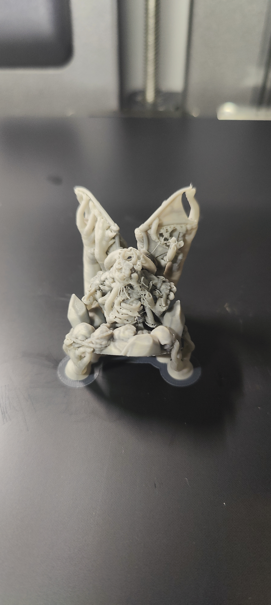
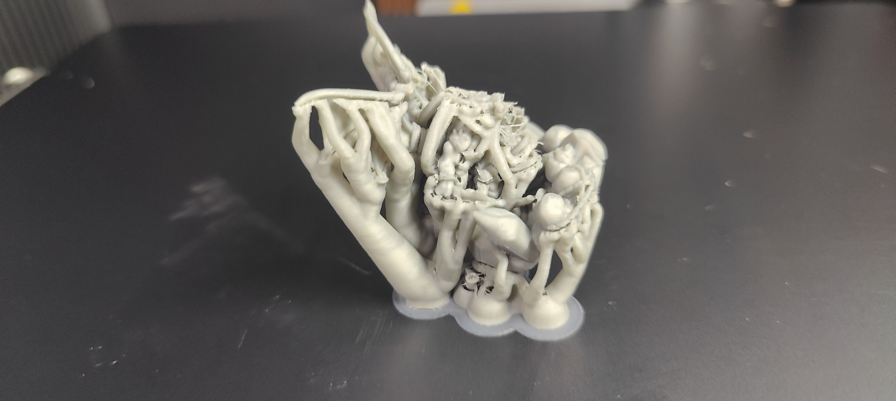
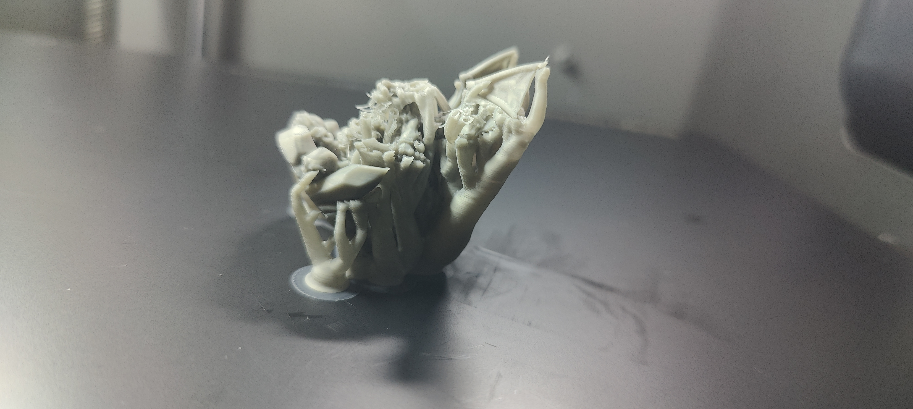
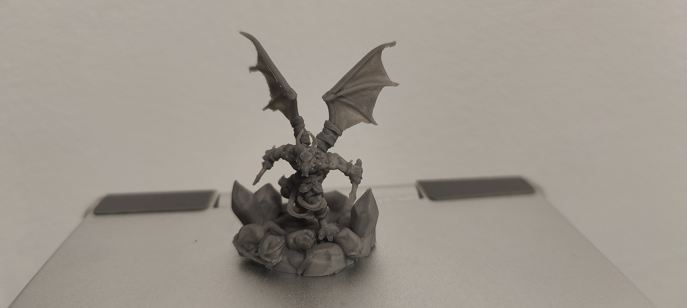
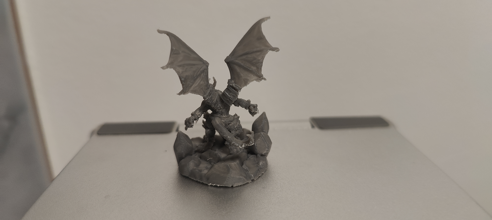

# Print Feedback

## Print Outcome
- **Success**: [ ] Yes / [ ] No / [x] Partial
- **Better than previous?**: [x] Yes / [ ] No / [ ] N/A

## Observations
- **Visual Quality**: 9/10 (The details on the undamaged parts remain incredible)
- **Dimensional Accuracy**: N/A
- **Strength/Durability**: Good (Miniature survived the difficult support removal mostly intact, though some spikes broke off around the tail)
- **Issues Encountered**:
  - **Support Removal Difficulty**: Open parts (wings, base) were easy to clean. Parts around the weapons were very challenging to reach but left no scars. The support between the legs (which merged with the belt) was notoriously hard to remove.
  - **Support Melting / Scarring**: The support running along the tail melted heavily with the miniature, leaving visible scars and causing some of the fine spikes to break off during removal.
  - **Oozing / Artifacts**: Noticeable oozing was found below the chin and in front of the left wing.
  - **Support Failure**: Some support trees broke during printing again, though thankfully it didn't cause the print to fail.

## Photos

## Notes
- **Conclusion**: We successfully pushed the limits of printing a dense model on a 0.2mm nozzle. However, the interface between the model and the supports along flat/long surfaces (like the tail) is still fusing too much. We also need to fix the oozing happening on the overhangs and stop the tree branches from snapping mid-print.
- **Goals for v0.0.4**:
  - Completely eliminate the melting/fusing of supports on long surfaces (the tail).
  - Solve the oozing issue under the chin and on the wings.
  - Strengthen the tree supports to prevent them from snapping midway.
- **Potential adjustments for next iteration**:
  - Review Top Z / Bottom Z distances again, or consider enabling/adjusting `Support interface` patterns and density to make long contact patches easier to peel.
  - Tweak retraction settings or temperatures slightly to combat the oozing on overhangs, without degrading the fine details.
  - Adjust tree branch settings (diameter, angle, density) to make the trunks sturdier so they don't break.
