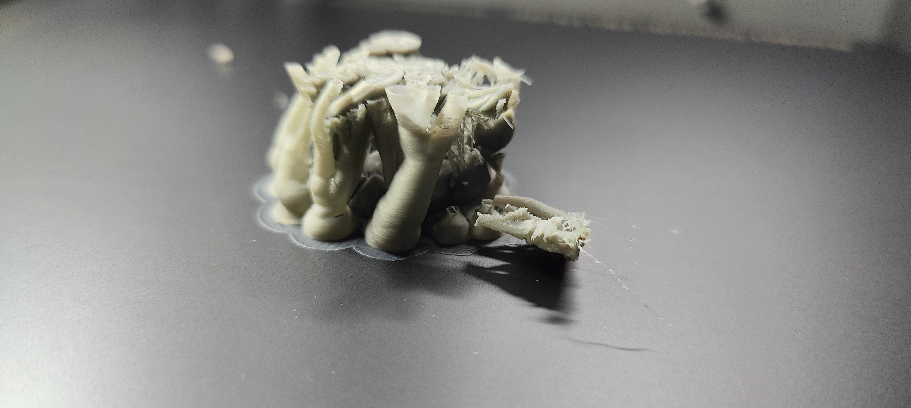
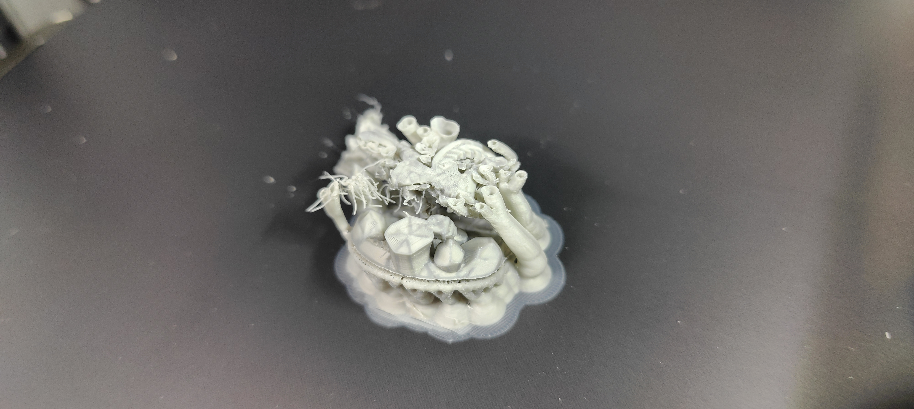

# Print Feedback

## Print Outcome
- **Success**: [ ] Yes / [x] No / [ ] Partial
- **Better than previous?**: [ ] Yes / [x] No / [ ] N/A

## Observations
- **Visual Quality**: N/A (Failed print)
- **Dimensional Accuracy**: N/A
- **Strength/Durability**: N/A
- **Issues Encountered**: Support failed and the print went spaghettis.

## Photos

## Notes
- The changes made to the support settings in v0.0.4 (thinner branches, increased branch distance) likely caused the supports to fail during printing, leading to the spaghetti.
