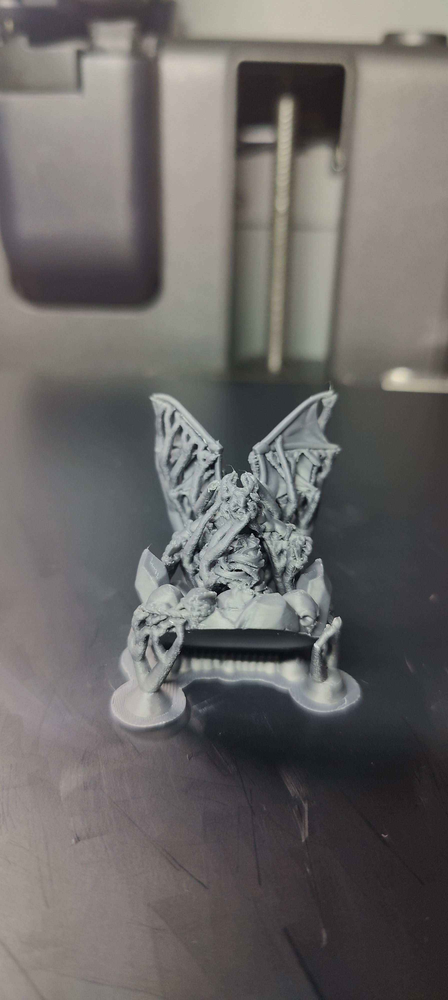
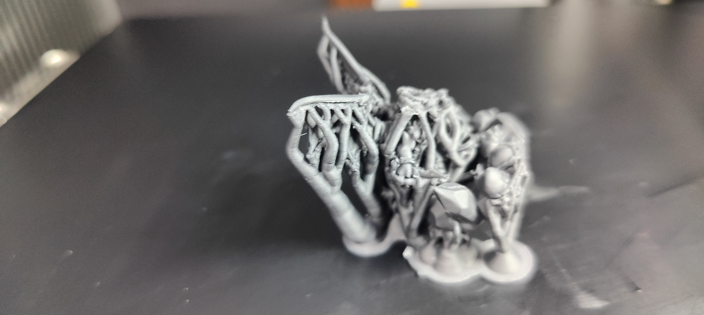
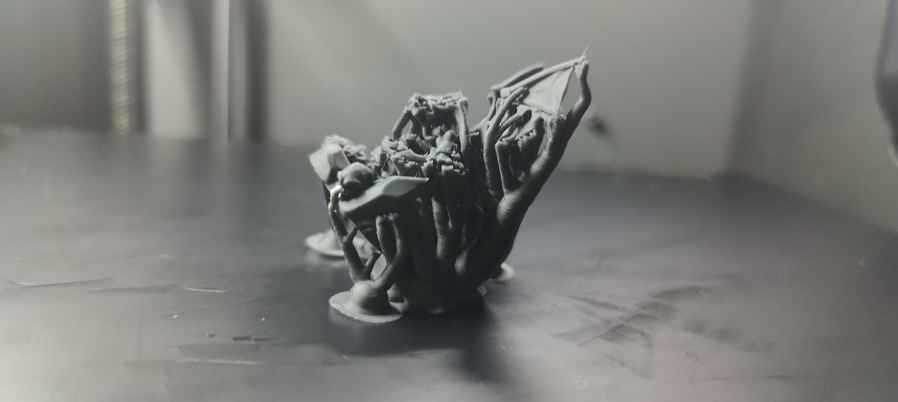
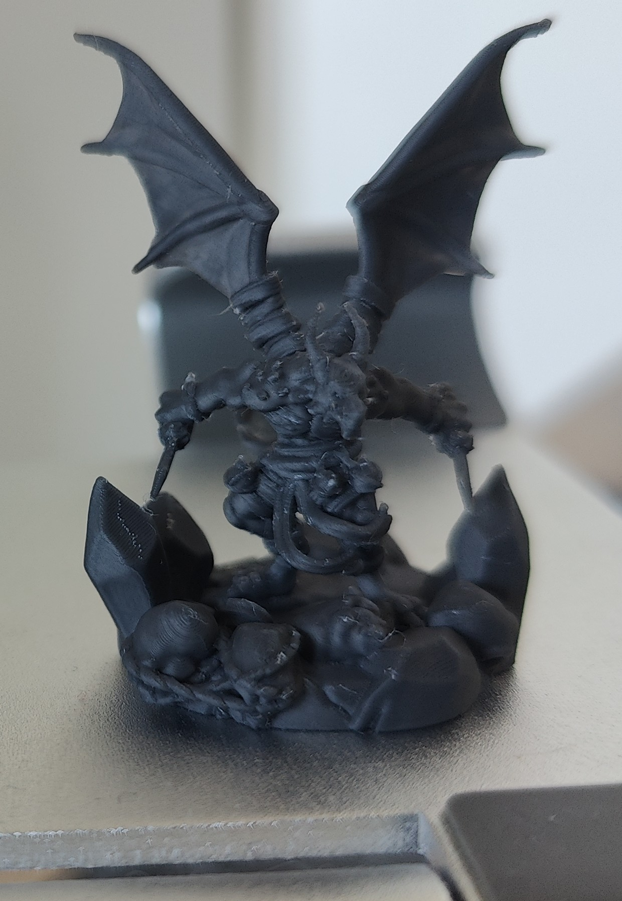
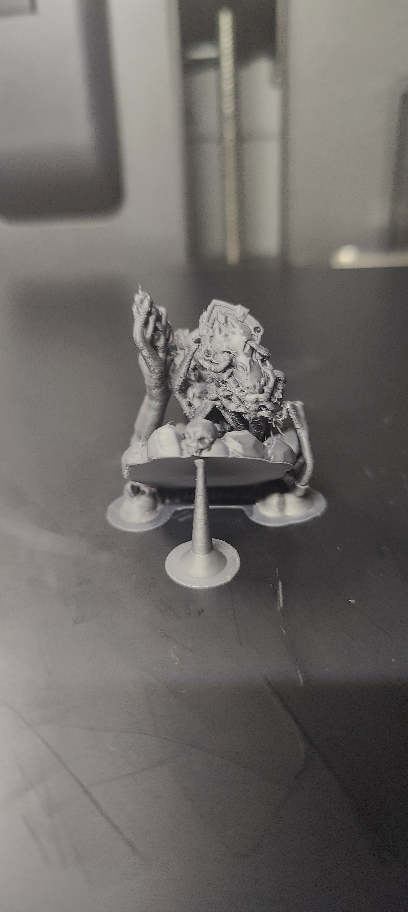
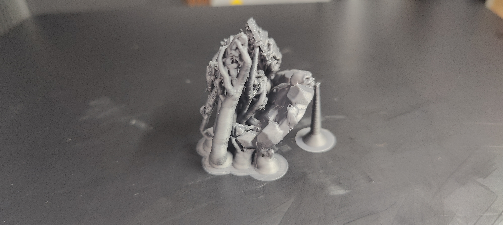
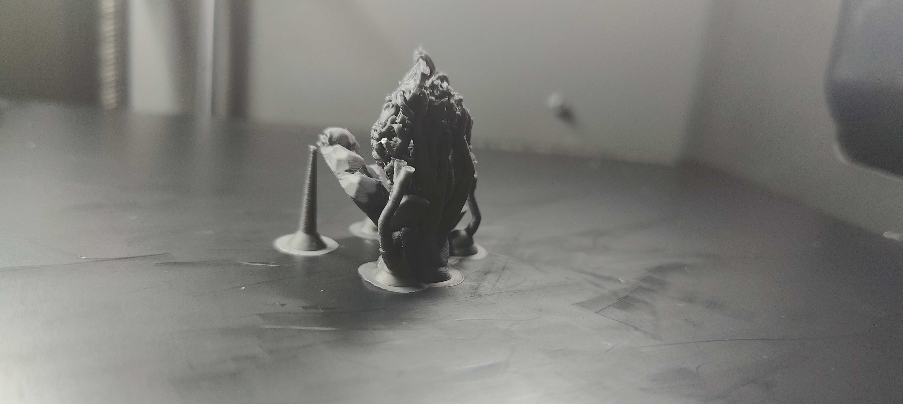
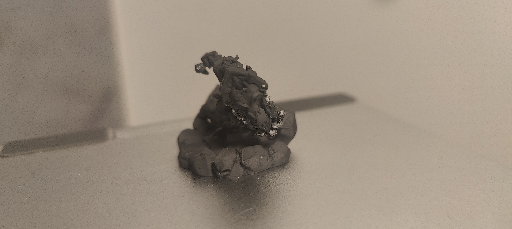
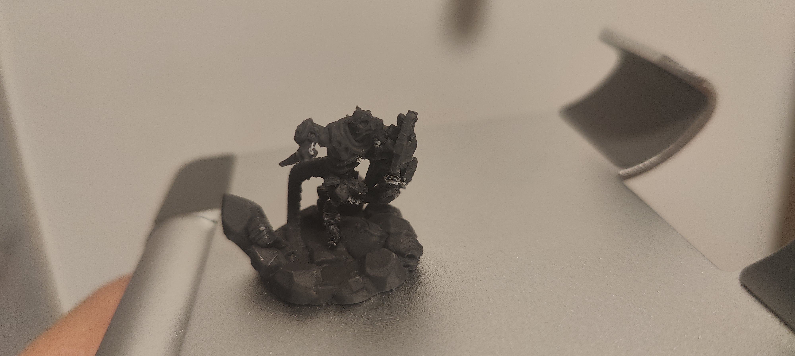

# Print Feedback

## Print Outcome
- **Success**: [X] Partial
- **Better than previous?**: [X] Yes (Visual quality improved)

## Observations
- **Visual Quality**: 9/10
- **Dimensional Accuracy**: Good details
- **Strength/Durability**: Thin parts (spear, leg) are fragile and broke during support removal.
- **Issues Encountered**: Support structures are extremely difficult to remove. They are "everywhere" and "pretty solid". In the second print, parts like the right leg, spear, and shield were completely engulfed, leading to the spear breaking and the leg twisting.

## Photos
### Print 1
- 
- 
- 
- 

### Print 2
- 
- 
- 
- 
- 

## Notes
- **Print 1**: Details are nice, but support was very hard to break. Managed to remove it by taking time.
- **Print 2**: Supports fused with the model or were too dense. Spear broke at front and back. Leg twisted because it was only sitting on support. Stopped removing shield support to avoid further damage.
- **Main Goal for v0.0.6**: Improve support ease of removal. Possibly increase top Z distance or reduce support density/interface density.
