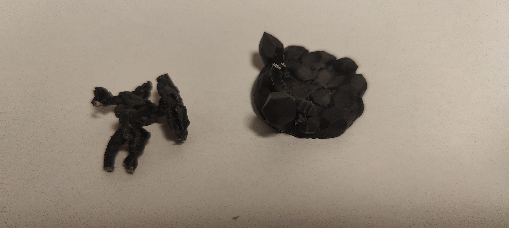
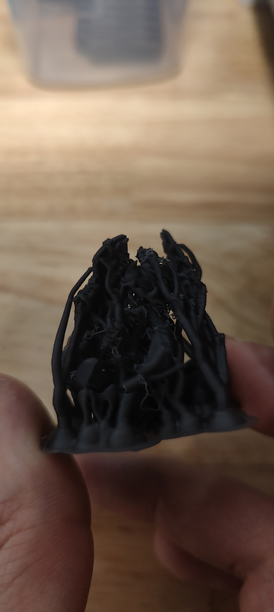
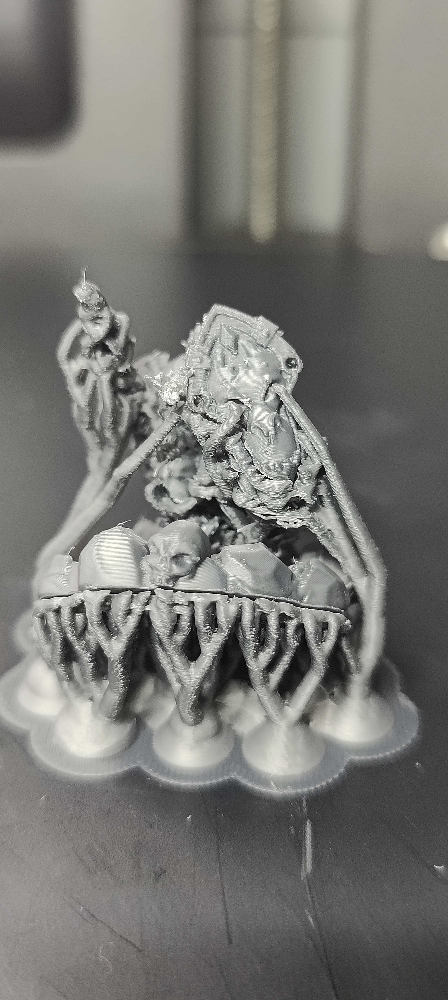

# Print Feedback

## Print Outcome
- **Success**: [ ] Yes / [ ] No / [X] Partial
- **Better than previous?**: [ ] Yes / [X] No / [ ] N/A

## Observations
- **Visual Quality**: 4/10 (Increased stringing and oozing on "feet in the air")
- **Dimensional Accuracy**: N/A
- **Strength/Durability**: Poor (Miniature feet and tail broke/separated from base)
- **Issues Encountered**: Increased stringing, support breakage, part engulfment (spear), part separation (feet/tail), oozing mess on overhanging parts.

## Photos
- 
- 
- 

## Notes
- Version seemed to produce more stringing than previous ones.
- Support breakage occurred, possibly during removal or print.
- Spear tip was easy to remove (good), but thin parts of the spear were engulfed and broke during removal.
- Shield removal was of medium difficulty, ended okay.
- "Feet in the air" (right one) resulted in an oozing mess.
- First time the miniature feet and tail separated from the base.
