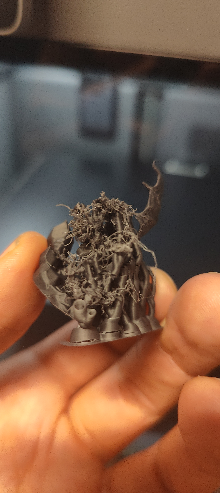
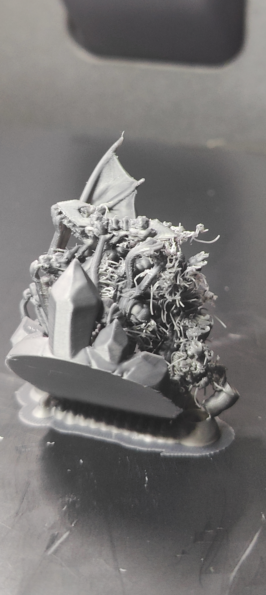

# Print Feedback

## Print Outcome
- **Success**: [ ] Yes / [ ] No / [x] Partial
- **Better than previous?**: [ ] Yes / [ ] No / [x] N/A (Pending further testing)

## Observations
- **Visual Quality**: Good on the fully supported side; wing printed perfectly without support.
- **Dimensional Accuracy**: 
- **Strength/Durability**: 
- **Issues Encountered**: A support failed on one side of the model, which resulted in massive oozing over that area for the remainder of the print. 

## Photos
- 
- 

## Notes
- The failure appears unrelated to the v0.0.9 settings changes. 
- The newly enabled `Make overhangs printable` setting performed flawlessly, allowing the top wing to be printed correctly with zero support needed and maintaining high quality.
- Evaluating the overall surface quality and ease of removal of the new support structure parameters from v0.0.8 will require another test print that does not experience unpredictable support failure.
